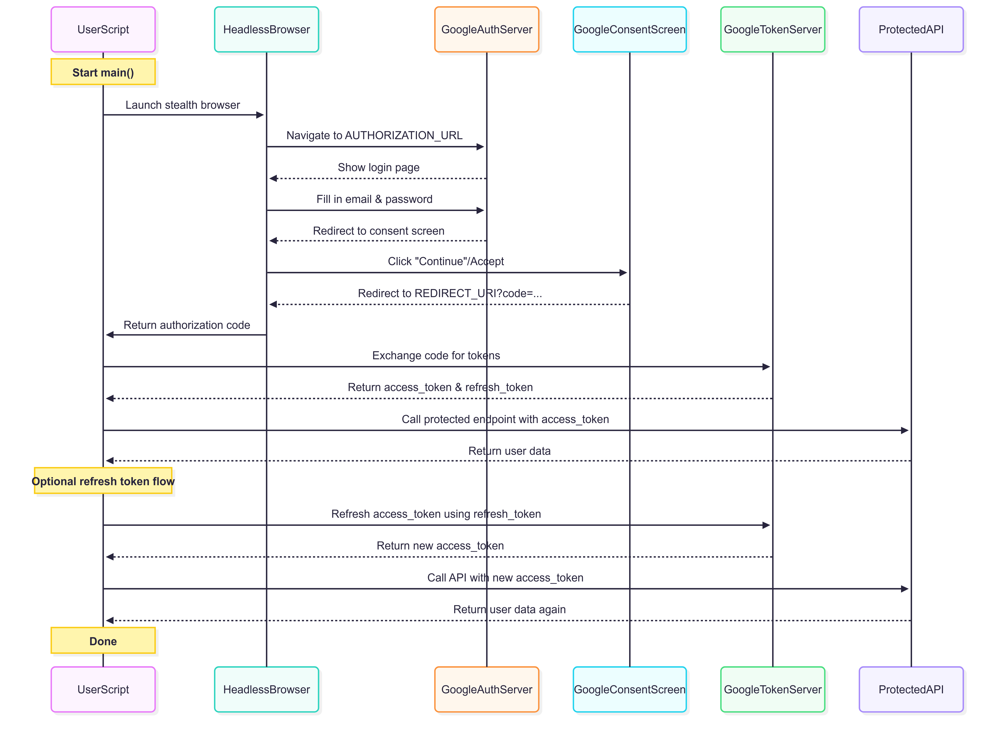

# 🔐 Automated OAuth 2.0 Testing (Auth Code + Refresh Token)

The main goal: **simulate a real user's login flow**, capture the authorization code, exchange it for tokens, and access protected resources — **all automatically**.

---

## ⚙️ What It Does

✅ Simulates a **real user login** via browser
✅ Extracts the **authorization code** automatically
✅ Exchanges it for **access + refresh tokens**
✅ Uses **access token** to hit a protected API
✅ Uses **refresh token** to get a new access token

---

## 🧠 How the "Browser Login" Catch Was Solved

Most automation tools get flagged by Google.
I used **`undetected-chromedriver`** with Selenium to stealthily log in, bypassing bot detection — the key to enabling real end-to-end OAuth testing.

---

## 🔧 Tools Used

| Tool                      | Why?                                       |
| ------------------------- | ------------------------------------------ |
| `undetected-chromedriver` | Bypass headless detection in Google login  |
| `Selenium`                | Automate login and consent screen          |
| `oauthlib` + `requests`   | Build and send standard OAuth 2.0 requests |
| `tempfile`                | Disposable browser profiles (clean runs)   |
| `Python`                  | Easy prototyping and scripting             |

---

## 🔁 Sequence Diagram



---

## ⚙️ Setup Instructions

1. **Create credentials on Google Developer Console**

  - Redirect URI: `http://localhost:8080`
  - Download `credentials.json` and place it in the root directory

2. **Set environment variables**

   ```bash
   export OAUTH_USERNAME=your_test_email@gmail.com
   export OAUTH_PASSWORD=your_password
   ```

3. **Install dependencies**

   ```bash
   pip install -r requirements.txt
   ```

4. **Run the script**

   ```bash
   python3 script.py
   ```

---

## 🧪 Sample Output

```
--- Starting OAuth 2.0 Authorization Code Grant Test in Stealth Mode ---

Step 1: Automating browser login to get authorization code...
Successfully retrieved authorization code: xxxxxxxxxxxxxxxxxxxx...

Step 2: Exchanging authorization code for tokens...
Access Token: ya29.A0ARrdaMxxxxxxxxxxxxx...
Refresh Token: 1//0gZxxxxxxxxxxxxxxxxxxxx...

Step 3: Accessing a protected resource...
User Info: {'email': 'testuser@gmail.com', 'name': 'OAuth Bot'}

--- Starting Refresh Token Flow ---
Successfully refreshed access token.
New Access Token: ya29.A0ARrdaMxxxxxxxxxxxxx...

User Info: {'email': 'testuser@gmail.com', 'name': 'OAuth Bot'}

--- OAuth 2.0 Automated Test Completed ---

```

---

👨‍💻 Developed by Piyush Dahake

